# Kids Money Manager - Architecture Documentation

## Overview

Kids Money Manager is a full-stack web application for managing children's money. It allows parents to track deposits and expenses for their children, while children can view their balance and recent transactions. The application includes expense categorization and visual analytics through pie charts.

## Tech Stack

### Frontend
- **React 18.2.0** - UI library for building the user interface
- **Vite 5.0.8** - Build tool and development server
- **Chart.js 4.4.0** - Charting library for data visualization
- **react-chartjs-2 5.2.0** - React wrapper for Chart.js
- **CSS3** - Styling with RTL (Right-to-Left) support for Hebrew

### Backend
- **Node.js** - JavaScript runtime
- **Express 4.18.2** - Web framework for RESTful API
- **MongoDB 6.3.0** - NoSQL database for data persistence
- **CORS 2.8.5** - Cross-Origin Resource Sharing middleware
- **dotenv 16.3.1** - Environment variable management

### Deployment
- **Vercel** - Frontend hosting and deployment
- **Railway** - Backend hosting and deployment
- **MongoDB Atlas** - Cloud database hosting

### Development Tools
- **Git** - Version control
- **GitHub** - Code repository
- **concurrently 8.2.2** - Run multiple npm scripts simultaneously

## Architecture Diagram


## Data Flow

### 1. User Authentication Flow


### 2. Add Transaction Flow


### 3. View Child Dashboard Flow


### 4. Data Synchronization Flow


## System Architecture

### Frontend Architecture

```
src/
├── main.jsx                 # Application entry point
├── App.jsx                  # Main app component with routing
├── components/
│   ├── ParentDashboard.jsx  # Parent interface
│   ├── ParentLogin.jsx      # Login screen
│   ├── ChildView.jsx        # Child interface
│   ├── BalanceDisplay.jsx   # Balance display component
│   ├── TransactionList.jsx  # Transaction list component
│   └── ExpensePieChart.jsx  # Pie chart component
├── utils/
│   ├── api.js               # API client functions
│   └── storage.js           # (Legacy - not used)
└── styles/
    └── App.css              # Global styles
```

### Backend Architecture

```
server/
├── server.js                # Express server and API routes
├── package.json             # Dependencies
└── .env                     # Environment variables (not in git)
```

### API Endpoints

| Method | Endpoint | Description |
|--------|----------|-------------|
| GET | `/api/children` | Get all children data |
| GET | `/api/children/:childId` | Get specific child data |
| GET | `/api/children/:childId/transactions` | Get child's transactions |
| GET | `/api/children/:childId/expenses-by-category` | Get expenses grouped by category |
| POST | `/api/transactions` | Add new transaction |
| POST | `/api/reset` | Reset all data |
| GET | `/api/health` | Health check |

## Data Models

### Child Document

```javascript
{
  _id: "child1" | "child2",
  name: "אדם חיים שלי" | "ג'וּן חיים שלי",
  balance: 0,  // Calculated from transactions
  transactions: [
    {
      id: "uuid",
      date: "2024-01-15T10:30:00.000Z",
      type: "deposit" | "expense",
      amount: 50.00,
      description: "תיאור",
      category: "משחקים" | "ממתקים" | "בגדים" | "בילויים" | "אחר" | null,
      childId: "child1" | "child2"
    }
  ]
}
```

### Transaction Object

```javascript
{
  id: "uuid",
  date: "ISO 8601 timestamp",
  type: "deposit" | "expense",
  amount: number,
  description: string,
  category: string | null,  // Only for expenses
  childId: "child1" | "child2"
}
```

## Key Features

### 1. Parent Dashboard
- View balances for both children
- Add deposits (money in)
- Record expenses with categories
- View all transactions
- Reset all data (with confirmation)

### 2. Child Dashboard
- View personal balance
- View recent transactions (last 15)
- View expense pie charts:
  - Last 7 days
  - Last 30 days
- Auto-refresh every 5 seconds

### 3. Expense Categories
- משחקים (Games)
- ממתקים (Candy)
- בגדים (Clothes)
- בילויים (Entertainment)
- אחר (Other)

## Security

- **Parent Access**: Password-protected (2016)
- **Session Storage**: Login state stored in sessionStorage (cleared on browser close)
- **CORS**: Configured to allow requests from Vercel frontend
- **Input Validation**: Server-side validation for all inputs
- **MongoDB Security**: Network access restricted, authentication required

## Deployment Architecture

```mermaid
graph LR
    subgraph Development
        Local[Local Development]
        Local -->|npm run dev| LocalServer[localhost:5173]
        Local -->|npm run dev:server| LocalAPI[localhost:3001]
    end
    
    subgraph Production
        GitHub[GitHub Repository]
        GitHub -->|Auto Deploy| Vercel[Vercel Frontend]
        GitHub -->|Auto Deploy| Railway[Railway Backend]
        Railway -->|Connects| MongoDBAtlas[MongoDB Atlas]
        Vercel -->|API Calls| Railway
    end
    
    style Vercel fill:#000000,color:#fff
    style Railway fill:#0E0E0E,color:#fff
    style MongoDBAtlas fill:#13AA52,color:#fff
```



## Environment Variables

### Frontend (Vercel)
- `VITE_API_URL` - Backend API URL (e.g., `https://your-app.up.railway.app/api`)

### Backend (Railway)
- `MONGODB_URI` - MongoDB connection string
- `PORT` - Server port (default: 3001)

## Build Process

### Frontend Build
1. Vite bundles React application
2. Output: `dist/` directory
3. Vercel serves static files from `dist/`

### Backend Build
1. Railway installs dependencies (`npm install`)
2. Starts server with `npm start`
3. Server listens on `0.0.0.0:PORT`

## Data Persistence

- **Storage**: MongoDB Atlas (cloud database)
- **Fallback**: In-memory storage (if MongoDB unavailable)
- **Data Structure**: One document per child in `children` collection
- **Balance Calculation**: Calculated dynamically from transactions array

## Performance Considerations

- **Auto-refresh**: Child views refresh every 5 seconds
- **Caching**: No explicit caching (real-time data)
- **Database**: MongoDB indexes on `_id` for fast lookups
- **CDN**: Vercel CDN for fast static asset delivery

## Error Handling

- **Frontend**: Try-catch blocks with user-friendly error messages
- **Backend**: Error middleware with detailed logging
- **API**: HTTP status codes (400, 404, 500)
- **Fallback**: Graceful degradation if MongoDB unavailable

## Future Enhancements

- User authentication system
- Multiple parent accounts
- Export transactions to CSV/PDF
- Email notifications
- Mobile app version
- Advanced analytics and reports

## Version History

- **v1.03** - Added expense categories and pie charts
- **v1.02** - Added reset balances button
- **v1.01** - Initial release with basic features

---

**Last Updated**: December 2024

