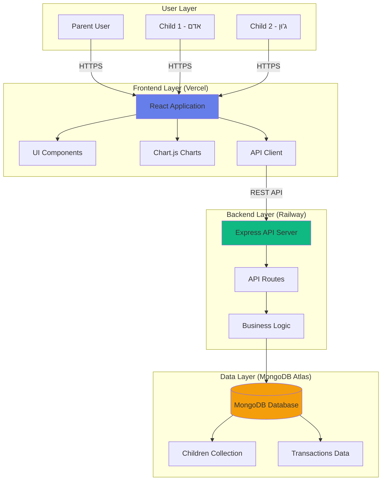
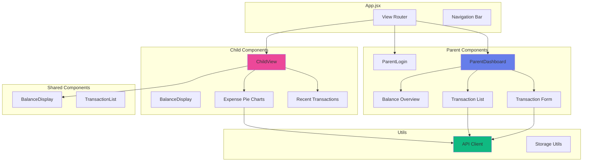
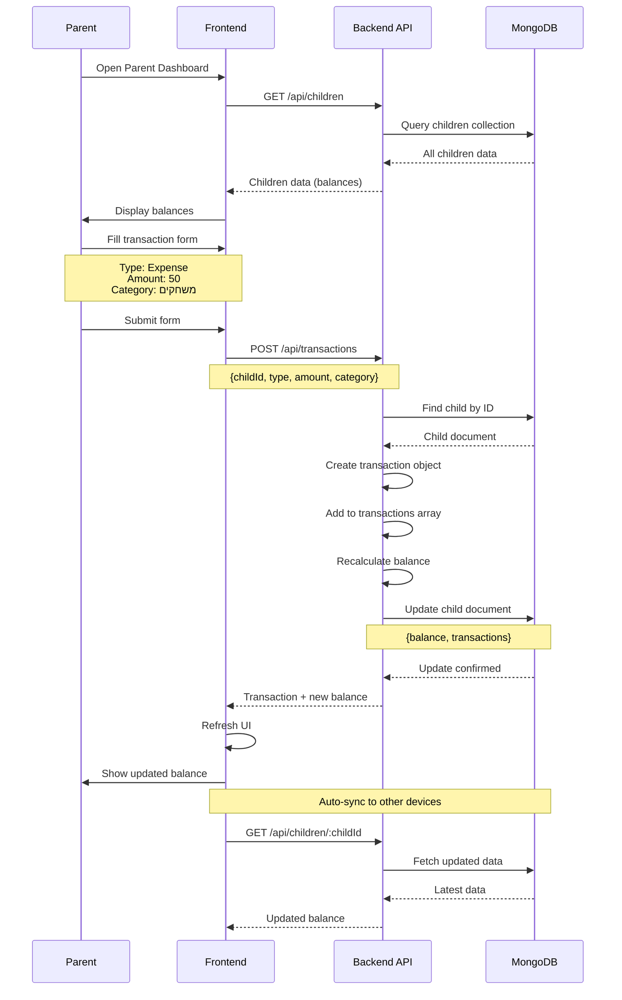
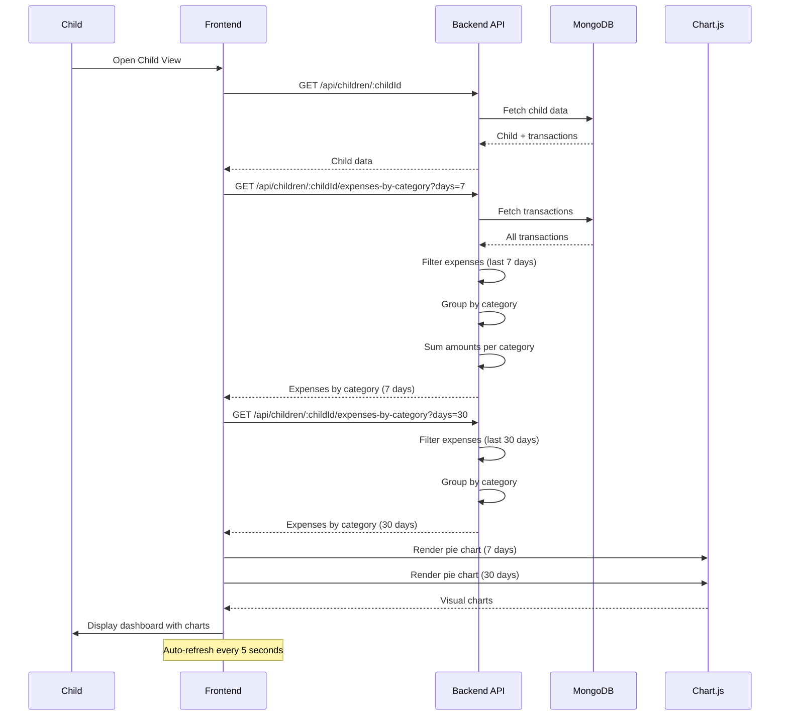
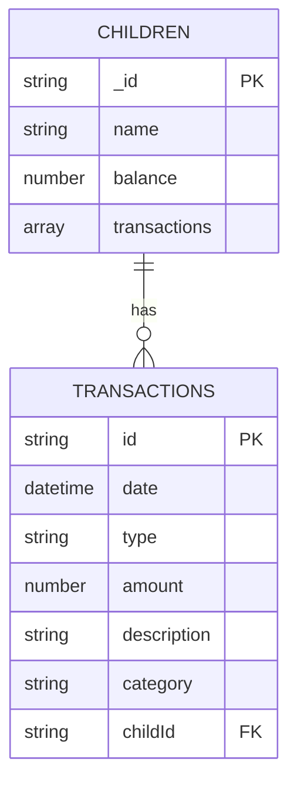
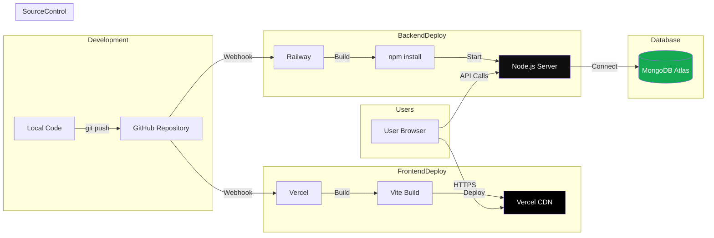
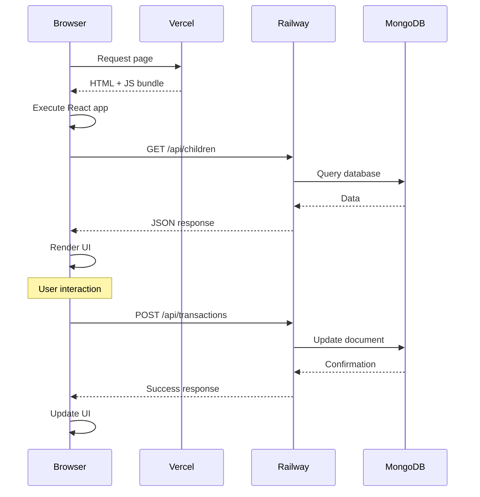
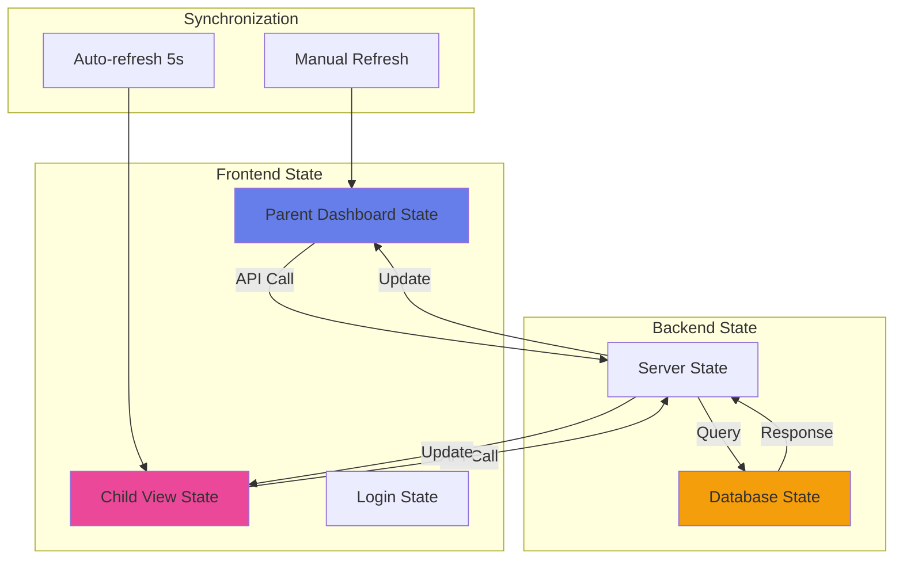
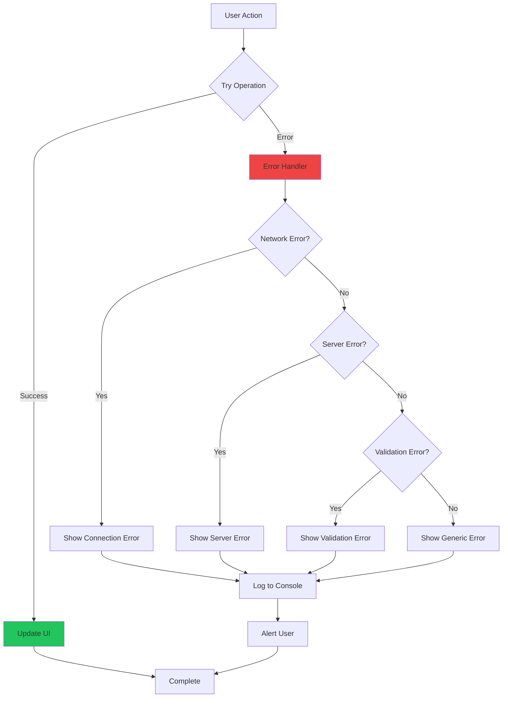

# Architecture Diagrams

## System Overview

## Component Architecture

## Data Flow - Complete Transaction Lifecycle

## Expense Analytics Flow

## Database Schema

## Deployment Flow

## Request/Response Flow

## State Management Flow

## Error Handling Flow

---

**Documentation Version**: 1.0  
**Last Updated**: December 2024

